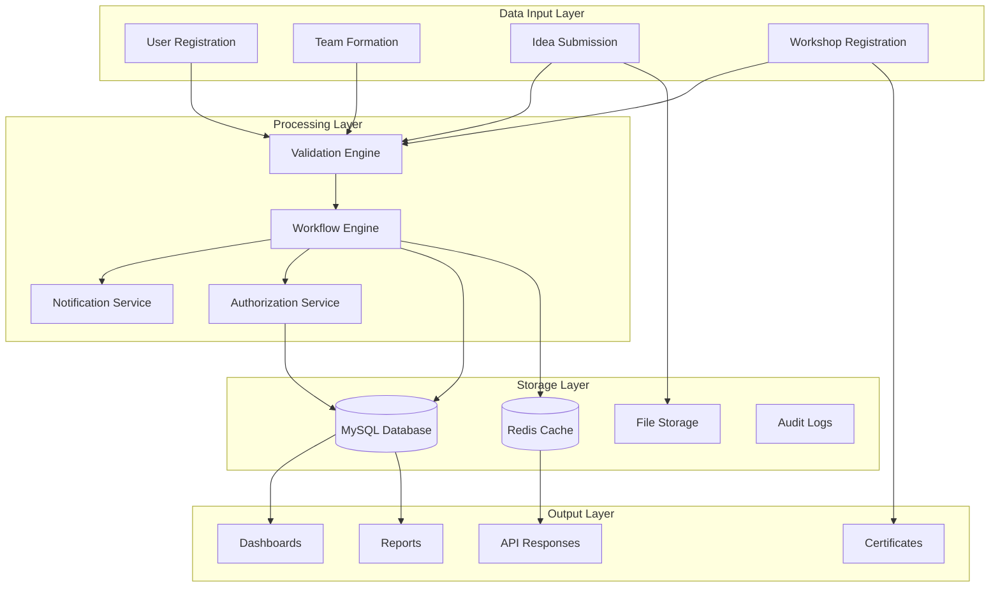

# System Analysis Document
## GuacPanel Hackathon Management System

---

## 1. Business Process Analysis

### 1.1 Core Business Processes

#### Process 1: Hackathon Lifecycle Management
```yaml
Process Name: Hackathon Edition Management
Process Owner: System Admin
Frequency: Annual
Key Steps:
  1. Edition Creation:
     - Define hackathon year and theme
     - Set registration windows
     - Configure submission deadlines
     - Define evaluation criteria
     
  2. Track Configuration:
     - Create competition tracks
     - Assign supervisors
     - Set team limits
     - Define prizes
     
  3. Timeline Management:
     - Registration period: 30-45 days
     - Idea submission: 15-20 days
     - Review period: 7-10 days
     - Event duration: 2-3 days
     
Business Rules:
  - Each edition must have unique year
  - Minimum 3 tracks per edition
  - Maximum 100 teams per edition
  - Registration must close before idea submission opens
```

#### Process 2: Team Formation & Management
```yaml
Process Name: Team Lifecycle
Process Owner: Team Leader
Duration: Registration to Event End
Key Steps:
  1. Team Creation (Day 1):
     - Leader registers account
     - Creates team with unique name
     - Receives team code
     
  2. Member Recruitment (Days 2-7):
     - Send invitations via email/ID
     - Review join requests
     - Approve/reject members
     - Monitor team size (2-5 members)
     
  3. Team Activation (Day 7+):
     - Minimum 2 members required
     - Team status changes to 'active'
     - Can submit ideas
     
  4. Team Lock (After Submission):
     - No new members allowed
     - No member removal
     - Focus on idea development
     
Critical Success Factors:
  - Quick invitation response (72hr expiry)
  - Clear communication channels
  - Role clarity (leader vs member)
  - Permission management
```

#### Process 3: Idea Submission & Review
```yaml
Process Name: Idea Evaluation Pipeline
Process Owner: Track Supervisor
Duration: 7-14 days
Key Steps:
  1. Submission Phase:
     - Team leader initiates
     - Fills comprehensive form
     - Uploads supporting documents
     - Submits for review
     
  2. Initial Screening:
     - Supervisor assigned automatically
     - Completeness check
     - Eligibility verification
     - Priority assignment
     
  3. Detailed Evaluation:
     - Score four criteria (0-100)
     - Provide written feedback
     - Make decision (accept/reject/edit)
     - Document reasoning
     
  4. Feedback Loop:
     - Notify team of decision
     - If edits needed, specify requirements
     - Allow resubmission (max 3 times)
     - Track all changes in audit log
     
Performance Metrics:
  - Average review time: <48 hours
  - Acceptance rate: 60-70%
  - Resubmission success: 80%
  - Team satisfaction: >4/5
```

### 1.2 Supporting Processes

#### Workshop Management Process
```yaml
Process Flow:
  1. Workshop Creation → 
  2. Speaker Assignment → 
  3. Registration Opens → 
  4. Capacity Monitoring → 
  5. Reminder Sending → 
  6. QR Generation → 
  7. Attendance Tracking → 
  8. Certificate Issuance

Automation Points:
  - QR code generation (automatic)
  - Email confirmations (automatic)
  - Waitlist promotion (automatic)
  - Reminder emails (scheduled)
  - Attendance certificates (on-demand)
```

---

## 2. Data Flow Analysis

### 2.1 Information Architecture



### 2.2 Critical Data Paths

#### Path 1: User Registration → Team Creation
```
1. User submits registration form
2. System validates email uniqueness
3. System validates national ID
4. Account created with verification token
5. Email sent with verification link
6. User verifies email
7. User creates team (if leader)
8. Team code generated
9. Team record created
10. Leader added as first member
```

#### Path 2: Idea Submission → Review → Decision
```
1. Team leader initiates idea submission
2. Form data validated against rules
3. Files uploaded and scanned
4. Idea saved with 'draft' status
5. Leader submits for review
6. Status changes to 'pending_review'
7. Supervisor notified
8. Supervisor opens idea
9. Supervisor evaluates and scores
10. Decision recorded with feedback
11. Team notified of decision
12. Audit log updated
```

---

## 3. System Integration Points

### 3.1 External Integrations

```yaml
Email Service (SMTP):
  Provider: SendGrid/Mailgun
  Usage:
    - Account verification
    - Password reset
    - Team invitations
    - Status notifications
    - Workshop confirmations
  Volume: ~5000 emails/day
  
SMS Gateway:
  Provider: Twilio
  Usage:
    - 2FA codes
    - Urgent notifications
    - Workshop reminders
  Volume: ~500 SMS/day
  
Twitter API:
  Version: v2
  Usage:
    - Auto-post news
    - Event updates
  Frequency: 2-3 posts/day
  
File Scanning:
  Service: ClamAV
  Usage:
    - Scan uploaded files
    - Virus detection
  Processing: Async queue
```

### 3.2 Internal Integration Matrix

| Component | Integrates With | Method | Frequency |
|-----------|----------------|---------|-----------|
| Auth System | All Modules | Middleware | Every Request |
| Notification | Email, SMS, Push | Queue | Real-time |
| File Upload | Virus Scanner | Queue | On Upload |
| Cache | Database | Redis | 5-min TTL |
| Reports | Export Service | On-demand | Daily |
| Audit Log | All Actions | Sync | Real-time |

---

## 4. Performance Requirements Analysis

### 4.1 Load Calculations

```yaml
Expected Load:
  Concurrent Users: 1500
  Daily Active Users: 3000
  Peak Hours: 6PM - 10PM
  
Transaction Volumes:
  - User Registrations: 100/hour peak
  - Team Operations: 50/hour peak
  - Idea Submissions: 30/hour peak
  - Workshop Registrations: 200/hour peak
  - File Uploads: 100/hour peak
  
Database Transactions:
  - Reads: 10,000/hour
  - Writes: 1,000/hour
  - Complex Queries: 500/hour
```

### 4.2 Response Time Requirements

| Operation | Target | Maximum |
|-----------|--------|---------|
| Page Load | 1s | 2s |
| Form Submit | 1.5s | 3s |
| File Upload (15MB) | 10s | 30s |
| Report Generation | 5s | 15s |
| Dashboard Refresh | 2s | 5s |
| Search Results | 0.5s | 1s |

### 4.3 Scalability Strategy

```yaml
Vertical Scaling Triggers:
  - CPU > 80% for 5 minutes
  - Memory > 85% sustained
  - Response time > 3s average
  
Horizontal Scaling Plan:
  Phase 1: Single Server (0-500 users)
  Phase 2: Load Balanced (500-2000 users)
  Phase 3: Microservices (2000+ users)
  
Caching Strategy:
  - Page Cache: 1 hour
  - API Cache: 5 minutes
  - Static Assets: 24 hours
  - Session Data: In Redis
```

---

## 5. Security Analysis

### 5.1 Threat Model

```yaml
Authentication Threats:
  - Brute force attacks
  - Session hijacking
  - Password theft
  Mitigations:
    - Rate limiting (5 attempts/minute)
    - Secure session cookies
    - Password complexity rules
    - 2FA for admin accounts
    
Data Security Threats:
  - SQL injection
  - XSS attacks
  - CSRF attacks
  - File upload exploits
  Mitigations:
    - Prepared statements
    - Input sanitization
    - CSRF tokens
    - File type validation
    - Virus scanning
    
Authorization Threats:
  - Privilege escalation
  - Unauthorized access
  - Data tampering
  Mitigations:
    - Role-based access control
    - Resource-level permissions
    - Audit logging
    - Data integrity checks
```

### 5.2 Compliance Requirements

```yaml
Data Protection:
  - Personal data encryption
  - Right to deletion
  - Data portability
  - Consent management
  
Audit Requirements:
  - All state changes logged
  - User actions tracked
  - Admin activities monitored
  - Log retention: 1 year
  
Access Control:
  - Principle of least privilege
  - Regular permission audits
  - Segregation of duties
  - Multi-factor authentication
```

---

## 6. Risk Analysis

### 6.1 Technical Risks

| Risk | Probability | Impact | Mitigation |
|------|------------|--------|------------|
| Database failure | Low | High | Daily backups, replication |
| DDoS attack | Medium | High | Cloudflare, rate limiting |
| Data breach | Low | Critical | Encryption, security audits |
| System overload | Medium | Medium | Auto-scaling, monitoring |
| Integration failure | Medium | Low | Fallback mechanisms |

### 6.2 Business Risks

| Risk | Probability | Impact | Mitigation |
|------|------------|--------|------------|
| Low registration | Low | High | Marketing campaign |
| Deadline miss | Low | High | Buffer time, parallel work |
| User adoption | Medium | Medium | Training, documentation |
| Budget overrun | Low | Medium | Phased deployment |

---

## 7. Implementation Priority Matrix

### 7.1 MoSCoW Analysis

#### Must Have (Week 1-4)
- User registration and authentication
- Team creation and management
- Idea submission system
- Basic review workflow
- Email notifications
- Admin dashboard

#### Should Have (Week 5-6)
- Workshop registration
- QR code attendance
- Advanced reporting
- File upload with scanning
- Role-based permissions
- Audit logging

#### Could Have (Week 7-8)
- SMS notifications
- Twitter integration
- Advanced analytics
- Mobile responsiveness
- Dark mode
- Multi-language support

#### Won't Have (Future)
- Mobile apps
- AI-powered evaluation
- Video submissions
- Live streaming
- Payment processing

### 7.2 Development Sequence

```yaml
Sprint 1 (Days 1-5):
  - Environment setup
  - Database schema
  - Authentication system
  - Basic models
  
Sprint 2 (Days 6-10):
  - Team management
  - Idea submission
  - File uploads
  - Validation rules
  
Sprint 3 (Days 11-15):
  - Review system
  - Scoring mechanism
  - Notifications
  - Dashboard views
  
Sprint 4 (Days 16-20):
  - Workshop module
  - QR system
  - Attendance tracking
  - Reports
  
Sprint 5 (Days 21-25):
  - Admin panel
  - News management
  - Integrations
  - Testing
  
Sprint 6 (Days 26-30):
  - Performance optimization
  - Security hardening
  - Documentation
  - Deployment
```

---

## 8. Success Metrics

### 8.1 Key Performance Indicators (KPIs)

```yaml
User Metrics:
  - Registration conversion: >70%
  - Team completion rate: >80%
  - User satisfaction: >4.0/5.0
  - Support tickets: <5% of users
  
System Metrics:
  - Uptime: >99.9%
  - Response time: <2s average
  - Error rate: <0.1%
  - Successful transactions: >99%
  
Business Metrics:
  - Ideas submitted: >80% of teams
  - Workshop attendance: >60%
  - Review turnaround: <48 hours
  - Participant retention: >50%
```

### 8.2 Monitoring Dashboard

```yaml
Real-time Metrics:
  - Active users
  - System load
  - Error rates
  - Queue lengths
  
Daily Metrics:
  - New registrations
  - Ideas submitted
  - Reviews completed
  - Workshops attended
  
Weekly Reports:
  - User growth
  - System performance
  - Feature usage
  - Issue resolution
```

---

## 9. Maintenance & Support Plan

### 9.1 Support Structure

```yaml
Level 1 Support:
  - Password resets
  - Account issues
  - Basic navigation
  - FAQ responses
  Response: <1 hour
  
Level 2 Support:
  - Technical issues
  - Bug reports
  - Data corrections
  - Permission issues
  Response: <4 hours
  
Level 3 Support:
  - System failures
  - Security incidents
  - Data recovery
  - Critical bugs
  Response: <30 minutes
```

### 9.2 Maintenance Schedule

```yaml
Daily:
  - Backup verification
  - Log review
  - Performance check
  - Security scan
  
Weekly:
  - Software updates
  - Database optimization
  - Cache clearing
  - Report generation
  
Monthly:
  - Security audit
  - Performance review
  - Capacity planning
  - User feedback analysis
```

---

## 10. Documentation Requirements

### 10.1 Technical Documentation

- System architecture diagram
- API documentation
- Database schema
- Deployment guide
- Configuration manual
- Troubleshooting guide

### 10.2 User Documentation

- User registration guide
- Team leader manual
- Supervisor handbook
- Workshop management guide
- Admin manual
- FAQ document

### 10.3 Process Documentation

- Business process flows
- Standard operating procedures
- Escalation procedures
- Disaster recovery plan
- Change management process
- Training materials

---

## Conclusion

This system analysis provides a comprehensive view of the GuacPanel Hackathon Management System, covering all aspects from business processes to technical implementation. Use this document as a reference throughout the development and deployment phases.
